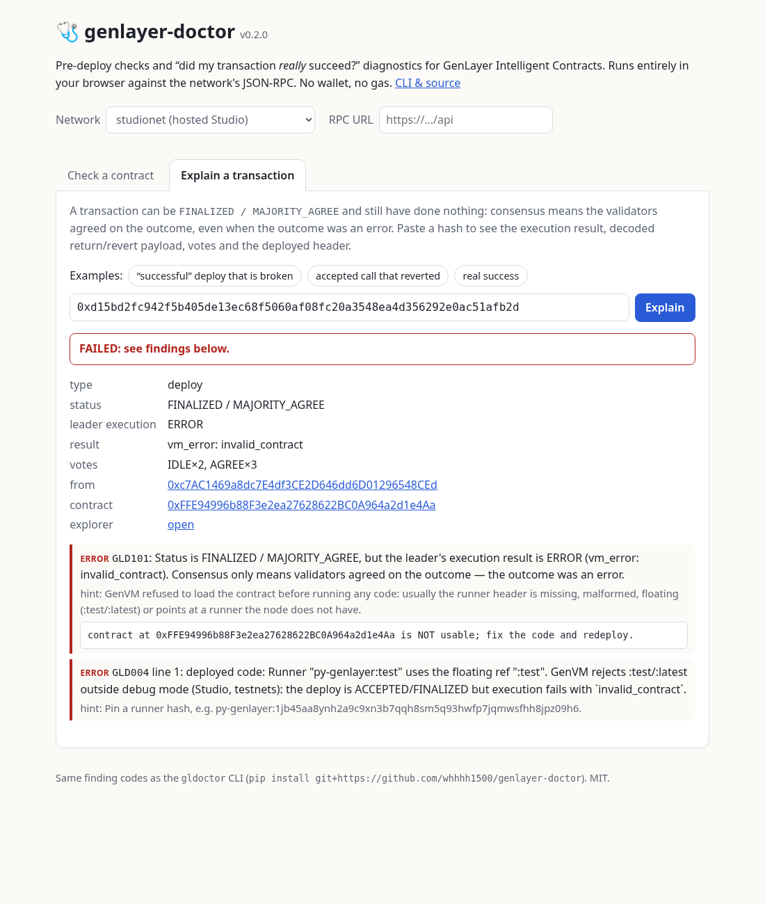

# genlayer-doctor

**Pre-deploy checks and transaction diagnostics for GenLayer Intelligent Contracts.**

`gldoctor` catches the contract bugs that slip past local linting and get reported as "success" by the network. It does three things:

1. **Lints the GenVM runner header** (`# { "Depends": "py-genlayer:<hash>" }`) offline.
2. **Dry-runs the contract on a real node** without gas, using `gen_getContractSchemaForCode`.
3. **Explains transactions**: it tells you whether a tx that reads `ACCEPTED / MAJORITY_AGREE` actually ran, or just reached consensus on an error.

It has zero runtime dependencies (Python ≥ 3.10, stdlib only) and works with Studio (hosted or local) and GLSim. It complements [`genvm-linter`](https://pypi.org/project/genvm-linter/) and does not replace it.

### Web UI: **https://whhhh1500.github.io/genlayer-doctor/**

The same checks run in the browser, with no install, wallet or gas:
- **Check a contract**: paste the source to get the header lint plus a gasless dry run on Studio, which returns the ABI or a decoded GenVM error with its traceback. *Fix header* pins the runner.
- **Explain a transaction**: paste a hash to see the consensus status next to the real execution result, the decoded return/revert payload, the votes, emitted transfers and the deployed header. Results are shareable as deep links, e.g. [`#tx=0xd15b…&net=studionet`](https://whhhh1500.github.io/genlayer-doctor/#tx=0xd15bd2fc942f5b405de13ec68f5060af08fc20a3548ea4d356292e0ac51afb2d&net=studionet).

It is a dependency-free ES module ([`docs/gldoctor.js`](docs/gldoctor.js)) that uses the same finding codes as the CLI. Parity tests run it against the CLI's recorded Studio fixtures (`node --test tests/js/`).



---

## Why

This is what happened when we deployed our first contract to GenLayer Studio. The contract came from the scaffold template and had `# { "Depends": "py-genlayer:test" }` on line 1:

```
genvm-lint check contract.py     ✓ Lint passed  ✓ Validation passed
deploy tx                        status FINALIZED, result MAJORITY_AGREE
```

Everything looked green, yet the contract address was unusable. Each validator's execution result was `ERROR / invalid_contract`, because GenVM refuses floating `:test` / `:latest` runners outside debug mode. The only place that said so was a `genvm_log` warning buried in the receipt.

Consensus means the validators **agreed on the outcome**, even when the outcome was an error. Tooling usually shows the consensus status, not the execution result. `gldoctor` checks both.

```
$ gldoctor check --network studionet contracts/*.py
gldoctor 0.2.0 · dry run on https://studio.genlayer.com/api
FAIL contracts/bad_floating_runner.py
  error GLD004 contracts/bad_floating_runner.py:1: Runner "py-genlayer:test" uses the floating ref ":test". GenVM rejects :test/:latest outside debug mode (Studio, testnets): the deploy is ACCEPTED/FINALIZED but execution fails with `invalid_contract`.
        hint: Pin a runner hash, e.g. py-genlayer:1jb45aa8ynh2a9c9xn3b7qqh8sm5q93hwfp7jqmwsfhh8jpz09h6 (`gldoctor fix --write`).
  error GLD004 contracts/bad_floating_runner.py: Dry run on node failed: The runner header uses py-genlayer:test or :latest, which GenVM only accepts in debug mode. Pin a runner hash.
        │ result: VM_ERROR invalid_contract
        │ genvm: :test/ :latest runner used in non-debug mode, this is not allowed
FAIL contracts/bad_import.py
  error GLD211 contracts/bad_import.py: Dry run on node failed: An import is not available inside the GenVM runner. Only the bundled stdlib subset and `genlayer` are available.
        │ stderr:   File "/contract.py", line 3, in <module>
        │ stderr:     import requests  # not available inside GenVM
        │ stderr: ModuleNotFoundError: No module named 'requests'
PASS contracts/hello_ok.py
  info  GLD200 contracts/hello_ok.py: Dry run OK: the node loaded the contract and produced its ABI.
        │ constructor(greeting: string)
        │ get_greeting() -> string  [view]
        │ set_greeting(new_greeting: string) -> null  [write]
```

```
$ gldoctor explain 0xd15bd2fc942f5b405de13ec68f5060af08fc20a3548ea4d356292e0ac51afb2d
FAILED  deploy tx 0xd15bd2fc…afb2d
  status           ACCEPTED / MAJORITY_AGREE
  leader execution ERROR  (vm_error: invalid_contract)
  votes            IDLE×2, AGREE×3
  contract         0xFFE94996b88F3e2ea27628622BC0A964a2d1e4Aa
  error GLD101 Status is ACCEPTED / MAJORITY_AGREE, but the leader's execution result is ERROR (vm_error: invalid_contract). Consensus only means validators agreed on the outcome — the outcome was an error.
        │ contract at 0xFFE9…e4Aa is NOT usable; fix the code and redeploy.
  error GLD004 deployed code: Runner "py-genlayer:test" uses the floating ref ":test". …
```

## Install

```bash
pip install git+https://github.com/whhhh1500/genlayer-doctor   # or: pip install -e . from a clone
gldoctor --help
```

## Usage

### `gldoctor check FILE...`
| flag | |
|---|---|
| *(none)* | offline: runner-header lint and a Python syntax check |
| `--network studionet` / `-n localnet` / `--rpc URL` | also run a **gasless dry run** on the node: GenVM loads the contract and builds its ABI, so it catches runner, import, syntax and module-level errors exactly as the node sees them |
| `--with-genvm-lint` | also run `genvm-lint lint` (if installed) and merge its result |
| `--strict` | exit 1 on warnings too |
| `--json` | machine-readable output for CI and editors |

Exit codes: `0` = pass, `1` = errors found, `2` = usage or RPC error.

> The public testnets (Asimov, Bradbury) don't expose `gen_getContractSchemaForCode`. `gldoctor` reports `GLD202` and continues with the offline checks. Dry-run on `studionet` before you deploy to a testnet.

### `gldoctor explain TX_HASH`
Fetches the transaction (default network is `studionet`; use `-n` or `--rpc` for others) and prints:
- the type, status and result name, the **leader's execution result** and the decoded GenVM result (`return`, `user_error (rollback)` or `vm_error`), the validator votes and the contract address;
- for deploys, the runner header of the **deployed source**, so you get the root cause and not just the symptom.

`--from-file tx.json` works offline on a saved `eth_getTransactionByHash` result. The exit code is `1` if the tx failed, which makes it easy to use in deploy scripts:
```bash
TX=$(genlayer deploy --contract contracts/app.py | grep -o '0x[0-9a-f]\{64\}' | head -1)
gldoctor explain "$TX" || { echo "deployment did not really succeed"; exit 1; }
```

### `gldoctor fix FILE... [--write] [--runner HASH]`
Shows a diff that pins every `py-genlayer:<ref>` in the header to the recommended runner hash. With `--write` it rewrites the file. If the header is missing it inserts one; if the header is misplaced it moves it to line 1; other dependencies in a `"Seq"` header are preserved.

### `gldoctor networks [--ping]`
Lists studionet, localnet, testnet-asimov and testnet-bradbury with their RPC URLs and chain IDs. `--ping` checks reachability and the chain ID.

## Checks

| code | severity | meaning |
|---|---|---|
| GLD001 | error | no runner header |
| GLD002 | error | header is not valid JSON |
| GLD003 | error | header has no `Depends` |
| GLD004 | error | floating `:test` / `:latest` runner (rejected outside debug mode) |
| GLD005 | error | malformed dependency or hash (expects 52-char GenVM hash) |
| GLD006 | warning | pinned to a runner other than the one in current docs |
| GLD007 | warning | header not on line 1 |
| GLD008 | warning | unknown runner name (typo?) |
| GLD010 | error | Python syntax error (offline) |
| GLD200 | info | dry run OK (ABI printed) |
| GLD201 | error | node refused the contract (`invalid_contract`) |
| GLD202/203 | warning | dry run unavailable on this RPC / node unreachable |
| GLD210–214 | error | syntax / missing module / NameError / exception at load / non-zero exit, with the traceback from GenVM |
| GLD101 | error | tx reached consensus but execution failed |
| GLD102 | error | tx ended CANCELED / UNDETERMINED / timeout |
| GLD103 | info | tx still pending |
| GLD300/301 | — | genvm-lint passthrough |

## CI

**pre-commit**
```yaml
- repo: https://github.com/whhhh1500/genlayer-doctor
  rev: v0.2.0
  hooks:
    - id: gldoctor          # offline
    # - id: gldoctor-studio # gasless dry run on studionet (needs network)
```

**GitHub Actions**
```yaml
- uses: whhhh1500/genlayer-doctor@v0.2.0
  with:
    files: contracts/*.py
    network: studionet   # optional; omit for offline checks
```

## Demo (live, GenLayer Studio, 2026-10-04)

`examples/demo_studio.py` (needs `pip install genlayer-py`) runs the whole story end to end with a real account. The full output is in `examples/demo_output.txt`.

| step | tx | result |
|---|---|---|
| deploy with `py-genlayer:test` | `0xd15bd2fc942f5b405de13ec68f5060af08fc20a3548ea4d356292e0ac51afb2d` | `ACCEPTED / MAJORITY_AGREE`, **gldoctor: FAILED** (`invalid_contract`) |
| `gldoctor check -n studionet` | – (no tx) | caught GLD004 before deploying |
| `gldoctor fix` + redeploy | `0x07e7020b20d8dd6a92e224964df8fe2c8647e8bdec82a9baa8a6e5e6fe18195a` | OK → contract [`0x137881b396C7FA0115C1DCe81C50E7a5d53AFcB2`](https://explorer-studio.genlayer.com/address/0x137881b396C7FA0115C1DCe81C50E7a5d53AFcB2) |
| `set_greeting` write | `0x3ce95ee7df48c041b7260b3442034d556f2d0da2a85fb425f9442fef9ac8bd87` | OK; read back `"checked by gldoctor before deploy"` |

```bash
GENLAYER_MNEMONIC_FILE=~/path/to/mnemonic.txt python examples/demo_studio.py   # or GENLAYER_PRIVATE_KEY=0x...
```

## Used by

- [AccessBond](https://github.com/whhhh1500/accessbond), an accessibility bounty escrow on GenLayer. Every deploy and write in its recorded Studio run was verified with `gldoctor explain`. One example: an `ACCEPTED / MAJORITY_AGREE` `finalize` that actually reverted with `challenge window still open` ([see it in the web UI](https://whhhh1500.github.io/genlayer-doctor/#tx=0xb5f63c7f34f5ac927b2c3b0b50f8637e30e9f34ad975549f240f55bc9b3adbf3&net=studionet)).

## Development

```bash
pip install -e ".[test]"
pytest                          # offline: recorded Studio responses in tests/fixtures
GLDOCTOR_LIVE=1 pytest -m live  # hits studio.genlayer.com
node --test tests/js/           # browser port (docs/gldoctor.js) against the same fixtures
python -m http.server -d docs   # web UI on http://localhost:8000 (Studio allows browser CORS)
```

The fixtures are real Studio JSON-RPC responses (validator `node_config` stripped). `examples/contracts/` holds one contract per failure mode.

## Limitations
- The dry run needs `gen_getContractSchemaForCode` (Studio, localnet, GLSim). On the testnets, explain support depends on the RPC returning Studio-style transaction objects.
- The recommended runner hash is pinned in `header.py` (`RECOMMENDED_RUNNERS`) from the current docs. Override it with `fix --runner`.
- Only runtime problems that show up at load or ABI time are caught by the dry run. Bugs inside method bodies still need tests (`gltest`, direct mode).

## License
MIT
